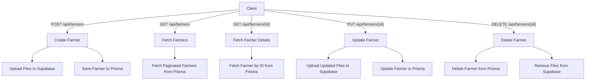

# Farmer Management System - Backend Documentation

This document provides a detailed overview of the backend implementation for the **Farmer Management System** built with Next.js, Prisma, and Supabase. It includes API endpoint descriptions,
environment variables, file structure, a flowchart, and step-by-step initialization commands.

---

## Table of Contents

1. [Environment Variables](#environment-variables)
2. [File Structure](#file-structure)
3. [API Endpoints](#api-endpoints)
4. [Flowchart](#flowchart)
5. [Step-by-Step Initialization](#step-by-step-initialization)
6. [Pending Tasks](#pending-tasks)

---

## Environment Variables

The following environment variables are required for the backend to function correctly. Add them to your `.env` file:

```env
# Supabase
NEXT_PUBLIC_SUPABASE_URL=your-supabase-url
NEXT_PUBLIC_SUPABASE_ANON_KEY=your-supabase-anon-key
NEXT_PUBLIC_SUPABASE_SERVICE_ROLE_KEY=your-supabase-service-role-key

# Database
DATABASE_URL=your-database-url
```

---

## File Structure

The backend is organized as follows:

```
app/
  api/
    farmers/
      route.ts          // Handles GET /api/farmers and POST /api/farmers
      [id]/
        route.ts        // Handles GET /api/farmers/[id], PUT /api/farmers/[id], DELETE /api/farmers/[id]
  lib/
    prisma.ts           // Prisma client initialization
    supabase.ts         // Supabase client initialization
    schema.ts           // Zod schemas for validation
    utils.ts            // Utility functions (e.g., file upload)
```

---

## API Endpoints

### 1. **POST /api/farmers**

Creates a new farmer record. Handles file uploads to Supabase Storage.

#### Request Body (Multipart Form Data)

| Field         | Type   | Description                     |
| ------------- | ------ | ------------------------------- |
| farmerName    | string | Name of the farmer              |
| relationship  | string | Relationship (S/o, W/o, D/o)    |
| gender        | string | Gender (Male, Female, Other)    |
| community     | string | Community (OBC, OC, BC, SC, ST) |
| aadharNumber  | string | Aadhar number (12 digits)       |
| state         | string | State                           |
| district      | string | District                        |
| mandal        | string | Mandal                          |
| village       | string | Village                         |
| panchayath    | string | Panchayath                      |
| dateOfBirth   | string | Date of birth (YYYY-MM-DD)      |
| age           | number | Age                             |
| contactNumber | string | Contact number (10 digits)      |
| accountNumber | string | Bank account number             |
| ifscCode      | string | IFSC code (11 characters)       |
| branchName    | string | Branch name                     |
| address       | string | Branch address                  |
| bankName      | string | Bank name                       |
| bankCode      | string | Bank code                       |
| fields        | JSON   | Array of field objects          |
| profilePic    | File   | Profile picture                 |
| aadhar        | File   | Aadhar document                 |
| land          | File   | Land document                   |
| bank          | File   | Bank document                   |

#### Example Request

```bash
curl -X POST http://localhost:3000/api/farmers \
  -H "Content-Type: multipart/form-data" \
  -F "farmerName=John Doe" \
  -F "relationship=S/o" \
  -F "gender=Male" \
  -F "community=OBC" \
  -F "aadharNumber=123456789012" \
  -F "state=California" \
  -F "district=LA" \
  -F "mandal=Mandal" \
  -F "village=Village" \
  -F "panchayath=Panchayath" \
  -F "dateOfBirth=1990-01-01" \
  -F "age=33" \
  -F "contactNumber=1234567890" \
  -F "accountNumber=1234567890" \
  -F "ifscCode=SBIN0000123" \
  -F "branchName=Main Branch" \
  -F "address=123 Main St" \
  -F "bankName=Bank of Earth" \
  -F "bankCode=BOE123" \
  -F "fields=[{\"surveyNumber\":\"123\",\"areaHa\":10,\"yieldEstimate\":100,\"locationX\":12.34,\"locationY\":56.78}]" \
  -F "profilePic=@profile.jpg" \
  -F "aadhar=@aadhar.pdf" \
  -F "land=@land.pdf" \
  -F "bank=@bank.pdf"
```

---

### 2. **GET /api/farmers**

Fetches a paginated list of farmers.

#### Query Parameters

| Parameter | Type   | Description                            |
| --------- | ------ | -------------------------------------- |
| page      | number | Page number (default: 1)               |
| limit     | number | Number of items per page (default: 10) |

#### Example Request

```bash
curl -X GET "http://localhost:3000/api/farmers?page=1&limit=10"
```

---

### 3. **GET /api/farmers/[id]**

Fetches a specific farmer's details by ID.

#### Example Request

```bash
curl -X GET "http://localhost:3000/api/farmers/1"
```

---

### 4. **PUT /api/farmers/[id]**

Updates a farmer's record. Handles file uploads.

#### Example Request

```bash
curl -X PUT "http://localhost:3000/api/farmers/1" \
  -H "Content-Type: multipart/form-data" \
  -F "farmerName=John Doe" \
  -F "relationship=S/o" \
  -F "gender=Male" \
  -F "community=OBC" \
  -F "aadharNumber=123456789012" \
  -F "state=California" \
  -F "district=LA" \
  -F "mandal=Mandal" \
  -F "village=Village" \
  -F "panchayath=Panchayath" \
  -F "dateOfBirth=1990-01-01" \
  -F "age=33" \
  -F "contactNumber=1234567890" \
  -F "accountNumber=1234567890" \
  -F "ifscCode=SBIN0000123" \
  -F "branchName=Main Branch" \
  -F "address=123 Main St" \
  -F "bankName=Bank of Earth" \
  -F "bankCode=BOE123" \
  -F "fields=[{\"surveyNumber\":\"123\",\"areaHa\":10,\"yieldEstimate\":100,\"locationX\":12.34,\"locationY\":56.78}]" \
  -F "profilePic=@profile.jpg" \
  -F "aadhar=@aadhar.pdf" \
  -F "land=@land.pdf" \
  -F "bank=@bank.pdf"
```

---

### 5. **DELETE /api/farmers/[id]**

Deletes a farmer's record.

#### Example Request

```bash
curl -X DELETE "http://localhost:3000/api/farmers/1"
```

---

## Flowchart



---

## Step-by-Step Initialization

### 1. **Install Dependencies**

Install the required dependencies for the project:

```bash
npm install @prisma/client @supabase/supabase-js zod
```

---

### 2. **Initialize Prisma**

Initialize Prisma in your project:

```bash
npx prisma init
```

This will create a `prisma` directory with a `schema.prisma` file.

---

### 3. **Set Up Prisma Schema**

Update the `prisma/schema.prisma` file with your database schema. For example:

```prisma
generator client {
  provider = "prisma-client-js"
}

datasource db {
  provider = "postgresql"
  url      = env("DATABASE_URL")
}

model Farmer {
  id            Int      @id @default(autoincrement())
  farmerName    String
  relationship  String
  gender        String
  community     String
  aadharNumber  String   @unique
  state         String
  district      String
  mandal        String
  village       String
  panchayath    String
  dateOfBirth   DateTime
  age           Int
  contactNumber String
  accountNumber String
  documents     Documents?
  bankDetails   BankDetails?
  fields        Fields[]
}

model Documents {
  id         Int     @id @default(autoincrement())
  profilePic String?
  aadhar     String?
  land       String?
  bank       String?
  farmer     Farmer  @relation(fields: [farmerId], references: [id], onDelete: Cascade)
  farmerId   Int     @unique
}

model BankDetails {
  id         Int    @id @default(autoincrement())
  ifscCode   String
  branchName String
  address    String
  bankName   String
  bankCode   String
  farmer     Farmer @relation(fields: [farmerId], references: [id], onDelete: Cascade)
  farmerId   Int    @unique
}

model Fields {
  id            Int    @id @default(autoincrement())
  surveyNumber  String
  areaHa        Float
  yieldEstimate Float
  locationX     Float
  locationY     Float
  farmer        Farmer @relation(fields: [farmerId], references: [id], onDelete: Cascade)
  farmerId      Int
}
```

---

### 4. **Run Prisma Migrations**

Run the following command to apply the schema to your database:

```bash
npx prisma migrate dev --name init
```

This will create the necessary tables in your database.

---

### 5. **Generate Prisma Client**

Generate the Prisma client:

```bash
npx prisma generate
```

---

### 6. **Set Up Supabase**

Initialize the Supabase client in your project. Create a `lib/supabase.ts` file:

```typescript
import { createClient } from '@supabase/supabase-js';

const supabaseUrl = process.env.NEXT_PUBLIC_SUPABASE_URL!;
const supabaseKey = process.env.NEXT_PUBLIC_SUPABASE_ANON_KEY!;

export const supabase = createClient(supabaseUrl, supabaseKey);
```

---

### 7. **Run the Development Server**

Start the Next.js development server:

```bash
npm run dev
```

---

## Pending Tasks

-  [ ] Add authentication and authorization for API endpoints.
-  [ ] Implement rate limiting for API requests.
-  [ ] Add unit tests for API endpoints.
-  [ ] Add integration tests for the entire system.
-  [ ] Optimize file uploads for large files.
-  [ ] Add logging for all API requests and responses.
-  [ ] Implement error handling for edge cases (e.g., invalid file types).
-  [ ] Add Swagger documentation for API endpoints.
-  [ ] Deploy the backend to a production environment.

---

This documentation provides a comprehensive overview of the backend implementation. Use the flowchart and checklist to track progress and ensure all tasks are completed.
